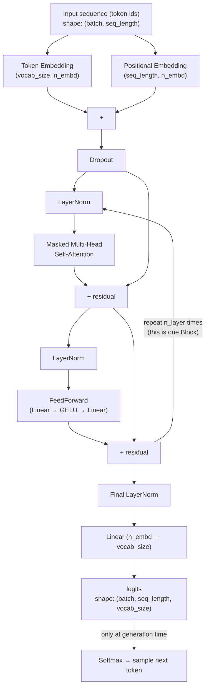

# `gpt.py` — the full decoder-only model

This is the target architecture (GPT-2 / nanoGPT), assembled from every piece in this folder. It is **not** the same as the Llama-style diagram you might see elsewhere (RoPE, GQA, RMSNorm, SwiGLU are 2023+ innovations) — GPT-2 (2019), what nanoGPT reproduces, makes different, older choices. See the comparison table below.

Every arrow's shape stays `(batch, seq_length, n_embd)` until the very last `Linear`, which projects up to `(batch, seq_length, vocab_size)` — see `ATTENTION.md` and `BLOCK.md` for exactly how each box gets there.

**Two different `LayerNorm` scopes, easy to conflate**: the `ln1`/`ln2` inside each block (see `BLOCK.md`) are *pre-norm* — applied before attention/feedforward, repeated twice per block, `n_layer` times over (12 separate `LayerNorm`s for `n_layer=6`). The **"Final LayerNorm"** in the diagram above is a *different*, single `nn.LayerNorm` instance, applied exactly once, only here in `gpt.py`, after the entire stack of blocks and before the output projection — not part of any block, not repeated. Both exist at the same time, for the same general reason (keep activations well-behaved through depth), just at different scopes.

## What we're building vs. the original (2017) and modern (2023+) choices

| Component | Original Transformer (2017) | **GPT-2 / nanoGPT (what we build)** | Modern, e.g. Llama-style |
|---|---|---|---|
| Positional info | Sinusoidal (fixed formula, not learned) | **Learned absolute positional embeddings** — just another `nn.Embedding(seq_length, n_embd)` | RoPE — rotates Q/K vectors by an angle based on position, encodes *relative* position, extrapolates to longer sequences better |
| Feedforward activation | ReLU | **GELU** — smoother, non-zero gradient for negative inputs, empirically better for language models | SwiGLU — a gated variant (needs an extra linear projection to compute the gate), used in Llama/PaLM |
| Normalization | LayerNorm, **post-norm** (norm applied *after* each sublayer, on the residual sum) | LayerNorm, **pre-norm** (norm applied *before* each sublayer, residual added separately) — trains more stably at depth | RMSNorm — skips mean-centering, cheaper to compute, similar effect |
| Attention heads | Standard multi-head (same number of K/V heads as Q heads) | **Standard multi-head** | Often GQA (grouped-query attention) — fewer K/V heads than Q heads, shares them across groups, saves memory during inference |

We're building the middle column throughout `ATTENTION.md`, `BLOCK.md`, and this file — deliberately, since that's GPT-2's actual design and the goal of this project. The other two columns are noted here for context (why they exist, what problem they solve), not implemented.
